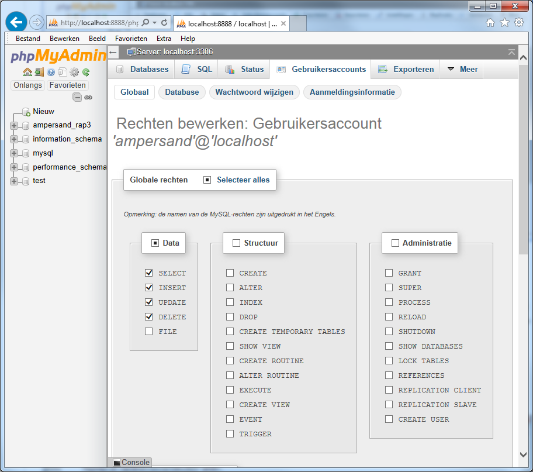
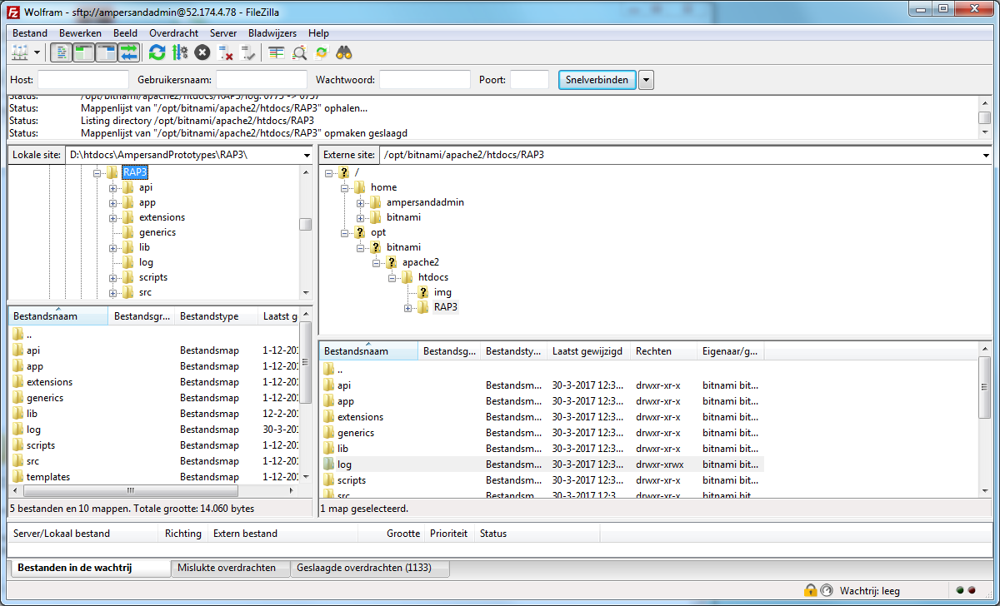
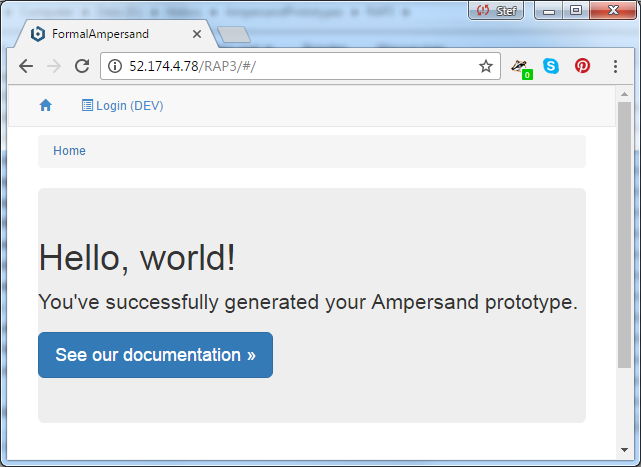

# Ampersand at the Open University of the Netherlands \(OUNL\)

In early 2016 the need arose to replace the RAP2 implementation of Ampersand by a RAP3 implementation, because RAP2 was insufficiently maintainable. This environment is used by students for completing the course Rule Based Design \(OBR, code ...\).  This implementation is hosted by ICTS, the IT-department of the university. We chose to implement RAP3 as a maintainable environment.

This chapter is an account of the installation process. It serves the following purposes:

1. It is an example for others who want to deploy Ampersand.  
   We get requests now and then by people who want to deploy Ampersand, so we figured it is nice to have a documented example for them.

2. It documents the installation we made for the Open University.  
   We want maintenance of RAP3 to be transferrable to other persons, so we need to document the choices made and the reasons for making them.

3. It contains all information needed to make a deployment script for automated deployment.  
   We want to automate deployment, so that RAP3 will always be up to date with the most recent stable release of Ampersand.

Each step in the installation process gets a separate section in this text. It is not necessary to do them in the given order.

## 1. Setting up the virtual machine

I got a server from the Open University's IT-department.

The following settings apply:

|  |  |
| :--- | :--- |
| server name | lnx-hrl-148v |
| OS | SUSE Linux Enterprise Server 12 SP2, vs. 12.2 |
| Admin user name | lru |
| verification type | password \(Lloyd Rutledge knows the password\) |
| Size | 4 core, 8 GB, 8 disks, Max. IOP's 8x500 |
| Inbound port: HTTP | TCP/80 |
| Inbound port: HTTPS | TCP/443 |
| Inbound port: SSH | TCP/22 |
| Inbound port: SFTP | TCP/22 |
| Public IP-adres | 145.20.188.148 |
| PHP version \(RAP3 requires PHP version 5.6 or higher\) | 7.0.7 |
| `{APPDIR}`=  the directory into which the RAP3 files will be deployed | /srv/www/htdocs |
| `{APPACC}`=  the account under which the RAP3 application will run \(the apache account, i.e. ${APACHE\_RUN\_USER} c.q. ${APACHE\_RUN\_GROUP} as defined in apache2.conf\) | wwwrun |
| `{APPHOST}` =  the URI of the machine that hosts the RAP3 application \(e.g. 'mydomain.org', or 'rap3.mydomain.org'\) |  |
| `{APPPORT}` =  the port at which the Apache server will be listening | 80 |
| `{APPURI}` = the URI at which the RAP3 application will be accessible for browsers \(e.g. 'mydomain.org/spreg', or 'spreg.mydomain.org'\) |  |
| `{APPURL}` = the full name for calling the application \(e.g. [https://mydomain.org:8080/spreg](https://mydomain.org:8080/spreg)', or [https://spreg.mydomain.org\](https://spreg.mydomain.org%29\) |  |

/unload gebruiken voor source code bestanden

tijdelijke bestanden op /tmp

standaardpakketten op /opt neerzetten

/var is bedoeld voor logbestanden

I have checked that the server works by browsing to "[http://145.20.188.148/test.php](http://145.20.188.148/test.php)" from outside the OUNL-network. This means that any applicable firewalls allow traffic on port 80 `{APPPORT}`. I have been able to access this machine through SSH \(using PUTTY\), but only after installing a VPN-tunnel to the server \(using Pulse Secure\).  I have verified the PHP-version  by using the command `php --version`. In the sequel, I will refer to this machine as "the server".

TODO: make sure that `{APPHOST}` can be found by DNS.

* if you want to use HTTPS, then ensure you install a valid server certificate \(e.g. through [https://letsencrypt.org/](https://letsencrypt.org/%29%29\)

## 2. Getting MySQL and phpMyAdmin to work

To run RAP3 requires Apache and MySQL. On a preinstalled MySQL-server you will need the database administrator password to set it up for Ampersand. This step requires hardware, so you must have finished section 1 successfully.

On this server, there is no MySQL, so I had to install it. I followed the instructions on `https://en.opensuse.org/SDB:LAMP_setup#Setting_up_MariaDB`.

First I installed `mariadb`and `mariadb-tools`:

`sudo zypper in mariadb mariadb-tools`

Then I started MariaDB:

`lru@lnx-hrl-148v:~> sudo systemctl start mysql`

To make sure the server will start at every boot:

`lru@lnx-hrl-148v:~> sudo systemctl enable mysql`

To set up MariaDB, I ran:

`sudo mysql_secure_installation`

By carefully following the instructions, I set up the MariaDB and chose root password `RAP3root`.

However, here the procedure failed:

`/usr/bin/mysql_secure_installation: line 234: .my.cnf.14336: No space left on device`

After logging into phpMyAdmin, create a user called 'ampersand' with password 'ampersand' and host 'localhost', in compliance with the defaults used in the Ampersand compiler. RAP3 requires at least the following authorizations:

## 3. Uploading and running RAP3

To run RAP3, the web-application must be installed on `/srv/www/htdocs`. This step requires sections 1 and 2 to be finished successfully. It also requires you to have a complete RAP3 web-application available for uploading to the server. If you don't have that web-application, you need to build it. Upon completion of step 8 you will have built that web-application by yourself.

To upload RAP3, I used the SFTP-protocol \(in Filezilla\) to upload the RAP3 web-application from my laptop onto the server. I put it on `/srv/www/htdocs`, which is the location of web-applications on this particular configuration. \(On vanilla Linux this would be on /var/www, I guess\). You must change the authorization of the 'log' directory \(.../htdocs/RAP3/log/\) to 757 \(public write access\) or else the application won't work.

This screenshot shows the situation after the transfer:

You can test whether this is successful by browsing to `145.20.188.148/RAP3/`

It should show:



If you need to restart the apache server for whatever reason, here is the command:

`sudo <TODO: look up on the internet>`

If there are problems, check the Apache server:

* Make sure that {APPACC} can read all files in {APPDIR}.

* Make sure that {APPACC} has write permissions \(on all files\) in the directory {APPDIR}/Log.

* If needed, edit Apache's config.ini so that:

  a\) it listens at {APPPORT}

  b\) users that call {APPURL} will be served {APPDIR}/index.php

  c\) Apache's .htaccess files are processed within {APPDIR} and its subdirectories.

  \(see e.g. [https://help.ubuntu.com/community/EnablingUseOfApacheHtaccessFiles\](https://help.ubuntu.com/community/EnablingUseOfApacheHtaccessFiles%29\)

  \`AllowOverride All\` should be set in the &lt;Directory /&gt; section, for example \(the directory statement must apply to at least {APPDIR}\):

  &lt;Directory /var/www/&gt;

  ```
        Options Indexes FollowSymLinks

        AllowOverride All

        Require all granted
  ```

  &lt;/Directory&gt;

* enable \`mod-rewrite\` extension \(see [http://askubuntu.com/questions/422027/mod-rewrite-is-enabled-but-not-working\](http://askubuntu.com/questions/422027/mod-rewrite-is-enabled-but-not-working%29\)

  * you can check if modules are enabled with cmd: apache2ctl -M. You should then find that the \`rewrite\_module\` is listed.

* ensure that the following extensions are enabled: curl, mysqli \(you might be able to check that by browsing to {APPURL}/phpinfo.php\).

## 3. Filling the Git repository with Ampersand files and Ampersand models

To build an Ampersand-compiler, we need the Ampersand source files, which reside in a GitHub repository. We can download these source files on a fresh server, so this step merely requires section 1 to be finished successfully. The RAP3 source files reside in a GitHub repository as well, so we'll just clone both repositories into the server.

I have used Git on the command line to get the Ampersand source code and the Ampersand model repository cloned onto the server.

I have created `/unload/git` for storing the local clones. Here is what I did:

`sudo mkdir /unload/git`

`cd /unload/git`

`sudo git clone https://github.com/AmpersandTarski/Ampersand`

`sudo git clone https://github.com/AmpersandTarski/Ampersand-models`

Unfortunately, this goes wrong:

Now you are done. The directory `/home/lru/git/Ampersand` contains the source code of the Ampersand compiler. The directory `/home/lru/git/Ampersand-models` contains the source code of the Ampersand models.

To verify that the Ampersand clone has succeeded and that you are in the development branch, navigate to `~/git/Ampersand` and ask for the Git status:

`lru@lnx-hrl-148v:~/git/Ampersand$ git status`

`On branch development`

`Your branch is up-to-date with 'origin/development'.`

`nothing to commit, working directory clean`

You can do the same in the `Ampersand-models` directory. There you must verify that you are in the master branch:

`lru@lnx-hrl-148v:~/git/Ampersand$ cd ../Ampersand-models/`

`lru@lnx-hrl-148v:~/git/Ampersand-models$ git status`

`On branch master`

`Your branch is up-to-date with 'origin/master'.`

`nothing to commit, working directory clean`

## 4. Installing Haskell

In order to build an Ampersand-compiler, we need a Haskell installation. We only need a working machine, so this step merely requires section 1 to be finished successfully.

I have used Haskell stack for installing Haskell. First I installed `stack` by following the instructions on the internet for a generic Linux installation:

`lru@lnx-hrl-148v:~$ sudo apt-get update`

`lru@lnx-hrl-148v:~$ curl -sSL https://get.haskellstack.org/ | sh`

Stack works. It is installed to `/usr/local/bin/stack`.

Stack gives a warning about the PATH:

`WARNING: '/home/lru/.local/bin' is not on your PATH.`

`For best results, please add it to the beginning of PATH in your profile.`

Haskell puts the binaries it produces on `~/.local/bin/`. For this reason I have added this directory to the `$PATH` variable by changing the file `~/.profile`. In this file I edited:

`# set PATH so it includes user's private bin if it exists`

`if [ -d "$HOME/.local/bin" ] ; then`

`PATH="$HOME/.local/bin:$PATH"`

`fi`

## 5. Creating an Ampersand-compiler

To generate RAP3 we need an Ampersand-compiler. The RAP3 user will also use that compiler. For both reasons, we need a working Ampersand compiler on the server. This step requires sections 3 and 4 to be finished successfully.

Having the source code of the Ampersand-compiler on the system, I created an executable by running `stack install`. Here is what I did:

`cd ~/git/Ampersand`

`stack setup`

`stack install`

A 1-core machine with 1.75GB memory has been shown too small to build the Ampersand-compiler. In that case, stack install does not show any progress. It got stuck without any hints about what is wrong. It did succeed on a 4-core 8GB configuration \(A4\).

## 6. Installing LaTeX and GraphViz

When the RAP3-user generates documentation, RAP3 will call on pdflatex, neato and dot. I found pdflatex already working. So I only had to install GraphViz. This can be done on a fresh server, so this step only requires section 1 to be finished successfully.

For generating pictures, Ampersand needs the commands `dot` and `neato`. For that purpose I installed:

```
lru@lnx-hrl-148v:~> sudo zypper install graphviz
```

That too worked.

## 7. Installing SmartGit \(a nice-to-have\)

For looking into the local Git repository, it is nice to have a Git-client installed. This step requires section 1 to be finished successfully.

When updates of Ampersand are being deployed, this is done via GitHub. For this reason it is convenient to have a Git-client on this machine. Sourcetree, however, does not work on Linux. So I installed Smartgit:

```
lru@lnx-hrl-148v:~$  sudo add-apt-repository ppa:eugenesan/ppa

lru@lnx-hrl-148v:~$  sudo apt-get update

lru@lnx-hrl-148v:~$  sudo apt-get install smartgit
```

I have not yet figured out how to run Smartgit on this machine.

## 8. Generating the RAP3 application

This step requires sections 3 and 5 to be finished successfully.

It requires to execute the following commands:

```
cd ~/git/Ampersand-models/RAP3/
ampersand.exe --meta-tables --add-semantic-metamodel -p/srv/www/htdocs/RAP3 RAP3.adl
chmod 757 /srv/www/htdocs/RAP3/log
```

Generating RAP3 might take a while. If everything works out, the compiler will terminate with the message: "Finished processing your model." If you want to monitor progress, append `--verbose` to the `ampersand` command. It will inform you of intermediate results. The chmod command is needed to ensure that your log directory is writable, in case RAP3 does logging. Logging can be switched on and off in your `localsettings.php` file.  Before compiling RAP3, you may want to check the version and the current branch of the RAP3 source code:

```
cd ~/git/Ampersand-models/
git status
```

If, for whatever reason, you want to delete earlier versions of the deployed RAP3-code, use this command:

`rm -r -f -d /srv/www/htdocs/RAP3`

## 9. Local Settings

This step requires section 3 to be finished successfully. This results in the existence of file`localsettings.php` on directory `~/git/Ampersand-models/RAP3/include`. This file contains comments that guide you to use the correct settings in a development situation and in a production situation. Read this file and follow the instructions, especially when making the transition from development to production.

## 10. Last minute changes before going to production

1. In the source code of RAP3, in the file SIAM\_importer.adl:
   1. disable "RAP3\_LoginForDevelopment.ifc", to prevent users from seeing 
   2. enable "RAP3\_LoginForProduction.ifc"
   3. disable "../SIAM/SIAM\_AutoLoginAccount.adl"
2. Read and follow the instructions in `localsettings.php` before going live.


