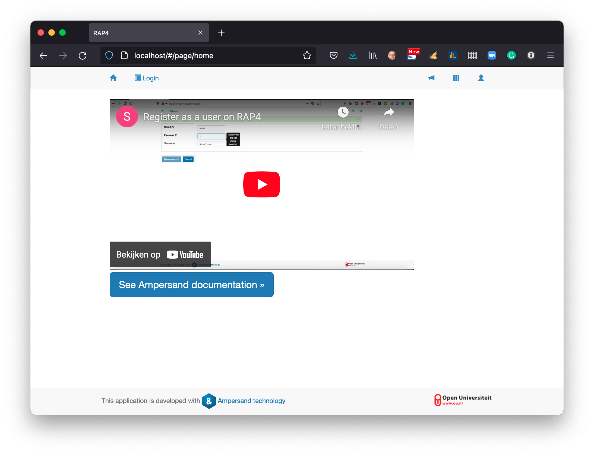
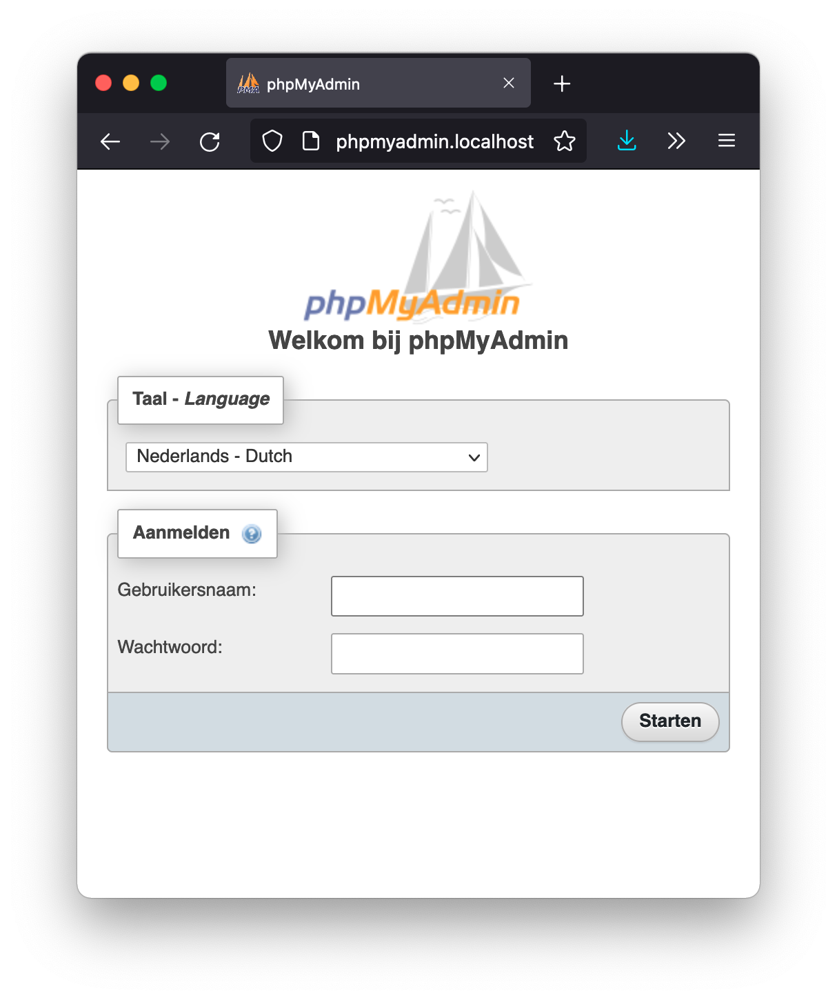
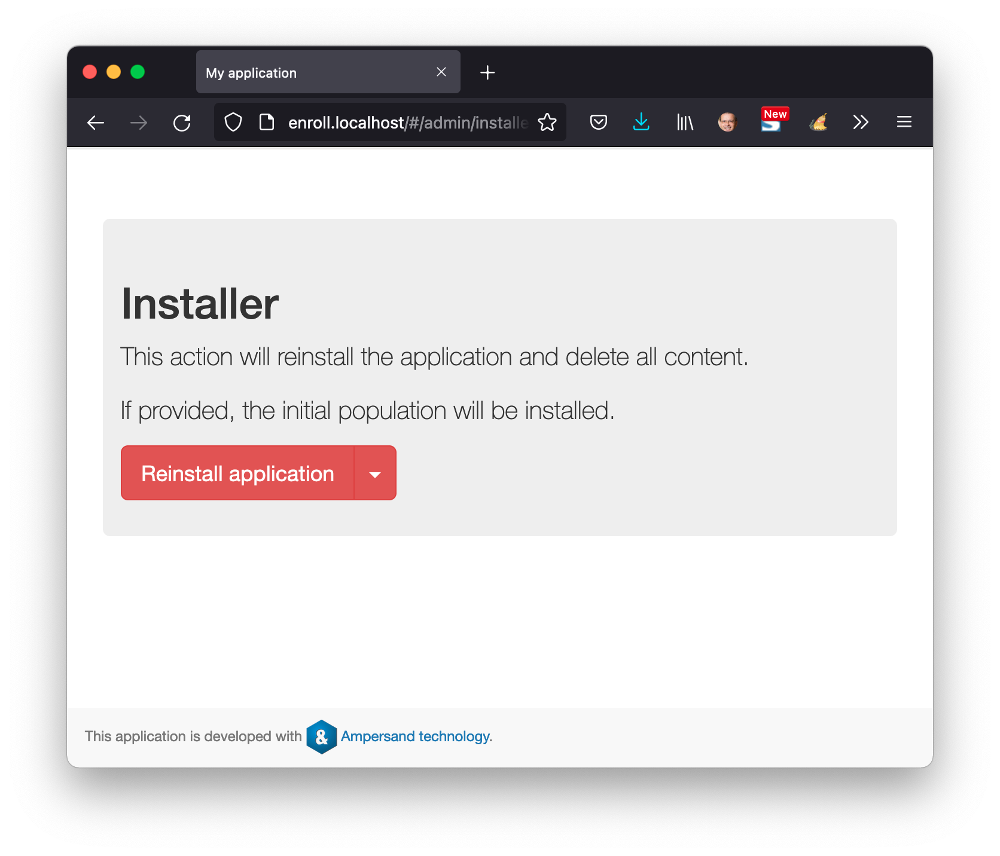

# Deploying to your own laptop

If you want to deploy RAP4 to your laptop, this chapter tells you how.

Each step in the installation process gets a separate section in this text.

This example has worked on my Macbook. If not, you may either change the commands below to the commands of your own computer, or set up a virtual linux machine on your laptop.


## Prerequisites

You need docker. Follow the instructions on`https://docs.docker.com/.`

You need git. Follow the instructions on `https://github.com/git-guides/install-git`.

## Obtaining the files we need

Import the required files from Github and go to the directory from which to install RAP:

```text
$ git clone https://github.com/AmpersandTarski/RAPinstall
Cloning into 'RAPinstall'...
remote: Enumerating objects: 19, done.
remote: Counting objects: 100% (19/19), done.
remote: Compressing objects: 100% (17/17), done.
remote: Total 19 (delta 2), reused 14 (delta 0), pack-reused 0
Unpacking objects: 100% (19/19), done.
$ cd RAPinstall
$ 
```

## Installing RAP4

To install RAP4 you need two commands:

```text
$  docker network create proxy
3f9552a7506ac5f2b5d9fcb158edae82f9f64e4e3d6b093916d624d118ba342a
$ docker compose up -d
[+] Running 8/8
 ⠿ Network rap_db                           Created                        4.7s
 ⠿ Network rap_default                      Creat...                       4.0s
 ⠿ Container rap_dummy-student-prototype_1  Started                        4.5s
 ⠿ Container traefik                        Started                        6.9s
 ⠿ Container rap4-db                        Started                        5.1s
 ⠿ Container enroll                         Started                       12.4s
 ⠿ Container rap4                           Started                       12.6s
 ⠿ Container phpmyadmin                     Star...                       12.1s
$ 
```

To check whether this worked, I went to my browser and navigated to `https://localhost`.

To prevent an error when running your prototype, execute the following commands:

```text
$ docker exec -it rap4 bash                      
root@2bf09123ebd1:/var/www# chmod 666 /var/run/docker.sock 
root@2bf09123ebd1:/var/www# exit
exit
$ 
```

Completion of this step allowed access to RAP4 from `localhost`:



Note that RAP runs on the insecure `http://` instead of `https://`.  This is not a problem if you keep your laptop safe from outsiders tresspassing. If you [depoy to a server](deploying-ounl-rap3.md), you need the setup for `https://`.

You will find that the database is accessible on `http://phpmyadmin/localhost`



The demonstration application, Enrollment, is accessible on `http://enroll.localhost`



