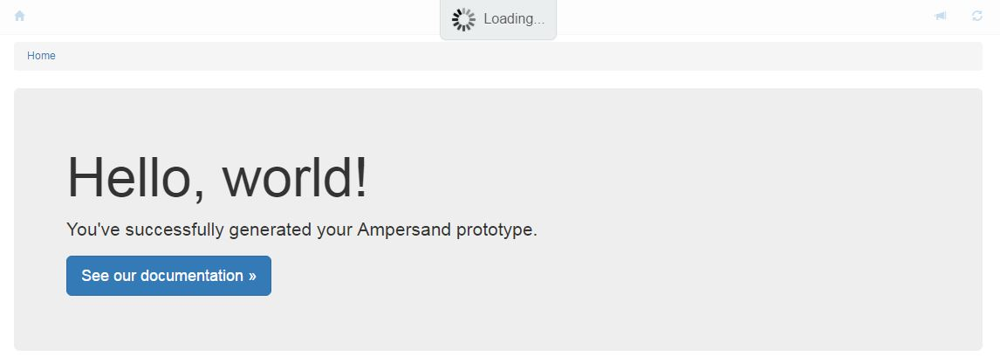

# Installation of RAP

RAP is a tool that will be used to enable students of OU to analyse Ampersand models, generating documents of it and so on. It will become the primary tool that students use in relation to Ampersand. 

**NOTE 1**: Because RAP is still in development, the branches to use in this stage are:
* Ampersand: ***development*** branch (https://github.com/AmpersandTarski/Ampersand/tree/development)
* ampersand-models: ***master*** branch (https://github.com/AmpersandTarski/ampersand-models.git)

**NOTE 2**: Be very keen not to break RAP2! RAP2 is still needed as a safety precausion, in case we cannot deliver RAP3 in time. 
##Recipe to install RAP:
This recipe assumes basic knowledge about system administration. 
1. First make sure you have a machine on which you can run Ampersand. Instructions to do so can be found [here](https://ampersandtarski.gitbooks.io/documentation/content/installation/installing_ampersand.html). NOTE: Don't forget to test this installation, so you are able to generate a pdf document from some example model. Also, make sure you can generate a prototype. 
2. In Git, get yourself a clone of https://github.com/AmpersandTarski/ampersand-models . That repository contains a directory RAP3, which contains the Ampersand application RAP.
3. go to the directory where you have `../ampersand-models/RAP3` and give the following command:
(Note: You might want to generate the prototype to a different path. This depends on where you have installed the webserver's htdocs)
```
      ampersand.exe --meta-tables --verbose  -p"D:\xampp\htdocs\RAP3\" RAP3.adl 
```
4. launch a browser, and go the URL of your RAP3 application (i.e. `foo.bar.ou/RAP3`) . If this succeeds, you will find something like:

5. Wait for the loading to finish. If all goes well, you should have a database named `ampersand_rap3`. Check this by using phpAdmin.

##Work in progress!
The application of RAP still is heavily under development. Therefor, this recipe might change. Also, instructions about maintenance will follow. Watch the progress of RAP3 by checking [this issue](https://github.com/AmpersandTarski/Ampersand/issues/449)

## Questions? Need help?
Don't hesitate to contact Han Joosten. He'll be glad to help out.