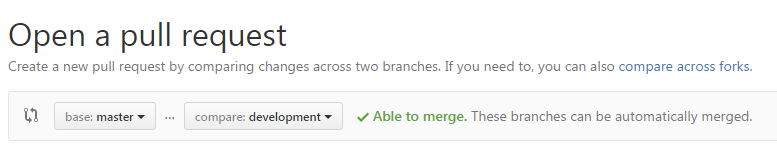

# Releasing Ampersand (And workflow details)

Working with Git gives a lot of possibilities on how to work as a team. I have been looking around what other teams do. For us, I guess we should keep it simple, and use the good stuff invented elsewhere. I think we should adapt to [gitflow workflow](https://www.atlassian.com/git/tutorials/comparing-workflows/gitflow-workflow), witch uses [feature branch workflow](https://www.atlassian.com/git/tutorials/comparing-workflows/feature-branch-workflow). 

The core idea of [feature branch workflow](https://www.atlassian.com/git/tutorials/comparing-workflows/feature-branch-workflow) is that each change is triggered by its own issue. So for each issue, a specific branch is created. It is developed, and once the developer(s) think it is ready, they do a pull request. Then, other collaborators inspect the code, do some testing. Once there is agreement that the fix/enhancement is good enough, then it can be pulled into the master. 

In [gitflow workflow](https://www.atlassian.com/git/tutorials/comparing-workflows/gitflow-workflow) we have the same thing, but there is also a develop branch. 

## Release notes

Every time someone pulls a feature branch into the [development branch](https://github.com/AmpersandTarski/Ampersand/tree/development), the release notes should be updated with a small description of the change. If we all keep up to this habit, it will become pretty easy to do a release, including an appropriate set of [release notes](https://github.com/AmpersandTarski/Ampersand/blob/development/ReleaseNotes.md). 

## Releasing at Github
Recently we have decided to release regularly. This means, once every 4 weeks. Of course, we want this to be as smooth as can be. Ideally, we want it fully automated. Yet, some manual tasks are required. This is described in the following paragraph. 

## Pre-release steps (what to do)

1. In `development` branch, modify the following files[1](#myfootnote1):
  * `ampersand.cabal`: 
    * bump the version number to release
  * `ReleaseNotes.md` : 
    * rename the "unreleased changes" section to the new version
    * add new "unreleased changes" section
2. Push your modifications to Github. (this will trigger automated testing by Travis)
3. Ensure travis-ci builds succesfully:
  * check the [build at travis](https://travis-ci.org/AmpersandTarski/Ampersand)
3. Create pull request to master:* 
4. Wait for all tests to complete, and pull the pull request into master.
5. Now that the master branch contains the new functionality, it will take some time for Appveyor to build the windows executable. This is a good time to prepare the releasenotes of the development branch for the new development cycle: Add a new title for unreleased changes to the releasenotes. 
6. Wait until [appveyor is ready crafting the release](https://ci.appveyor.com/project/hanjoosten/ampersand). This should take about 15 minutes.
7. Modify the title of the [newly created release](https://github.com/AmpersandTarski/Ampersand/releases/latest).
  * press the edit button, and add the current date to the title:
8. Check that the build contains the ampersand windows executable. It should, but currently (2 september 2016) there are problems with that. If it isn't there, build it and update the release manually. We have to fix appveyor.yaml

Notes, tips and tricks:

<a name="myfootnote1">1</a>: Looking for `ampersand.cabal` and `ReleaseNotes.md`? Want to know where they are located? Look in Github for the commit of the previous release. It shows changes were made to these files. From there, open their current (!) version. Please make sure your Git is working in the development branch.
